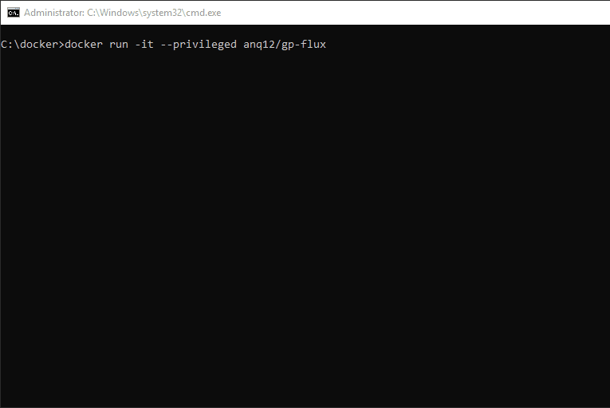
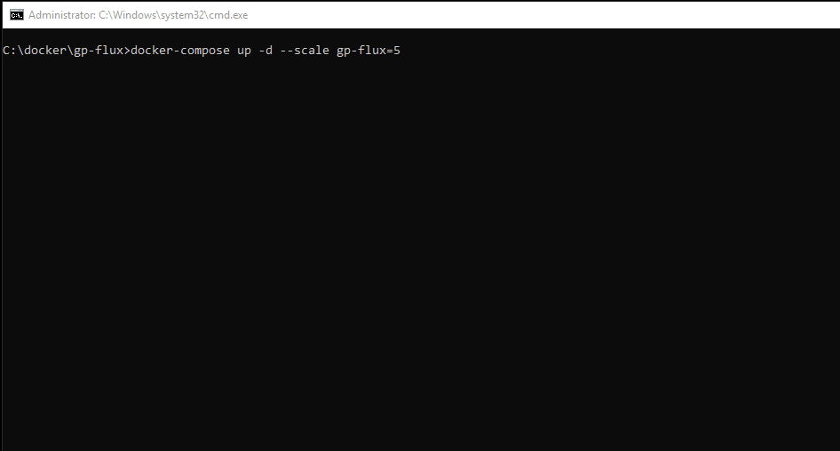
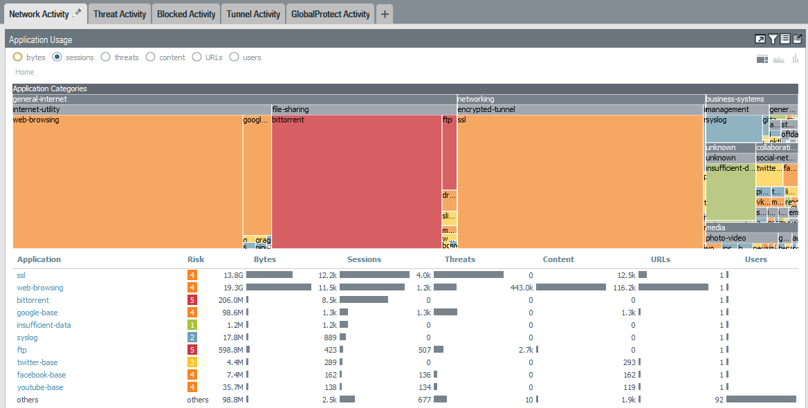
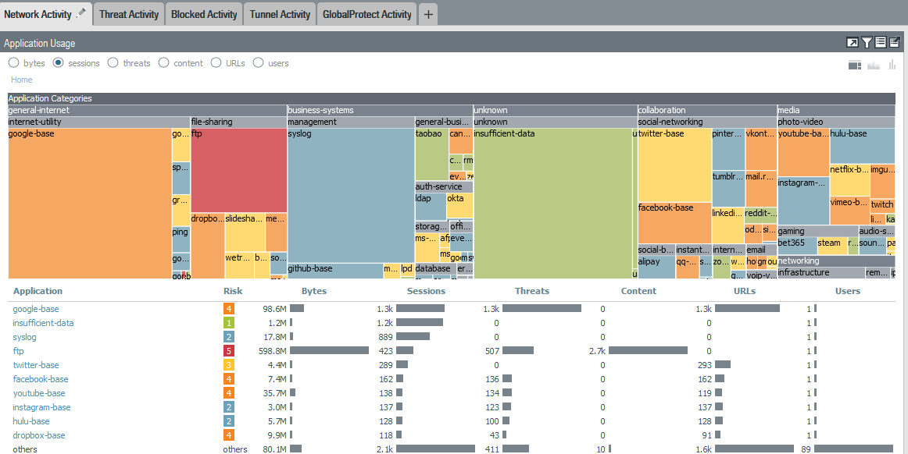

# gp-flux
Openconnect GlobalProtect client traffic generator. This image is designed for simulating real user network traffic and performing stability/throughput testing. Container will default run for 1 hour, can be changed with variable TIMEOUT=seconds.
Since the image uses Openconnect instead of the official GP software, a GlobalProtect Portal license is not required on firewall.

Getting started;

Single container, no client certificate:

docker run -it --privileged -e GP_USERNAME=CHANGE-ME -e GP_GATEWAY=CHANGE-ME -e GP_PASSWORD=CHANGE-ME anq12/gp-flux

Single container, client certificate/key in C:\docker\certificates

docker run -it --privileged --mount type=bind,source="C:\docker\certificates",target=/opt/gp-flux/certificates -e GP_USERNAME=CHANGE-ME -e GP_GATEWAY=CHANGE-ME -e GP_PASSWORD=CHANGE-ME anq12/gp-flux

10 containers, using docker-compose (variables in gp-flux.env file)

docker-compose up -d --scale gp-flux=10

Notes / Requirements:
- Container is designed to connect directly to GP Gateway. GP Portal -> Gateway is only supported if they use the same FQDN
- X-Auth is _not_ required on gateway - Openconnect will emulate GP client and use ESP/SSL
- Decryption of traffic is supported if CA cert is installed (see certificates/Certificate Instructions.txt)
- Only certificate-based 2FA is supported
- Multi-gateway selection is not supported
- All torrent files are from academictorrents.com

Default actions:
- Bittorrent (transmission-daemon) - 100KB/s up/down limit - 200 max peers
- Noisy.py HTTP/HTTPS - top 250 sites - no adult sites (as per PANW URL category)
- nmap against GP-issued DNS servers (option to add additional networks)
- curl all PANDB category-example sites
- wget Bacon Ipsum, syslog result to 8.8.8.8
- wget FTP - 200KB/s limit
- wget EICAR test malware files
- SMTP dummy files - swaks/smtpbucket

Examples:
Single instance using docker run

Multiple instances using docker-compose

ACC report ordered by sessions, 5 containers, running for two hours (DNS removed)

ACC report, same as above, but DNS/web-browsing/SSL/Bittorrent removed, to show scope of applications
