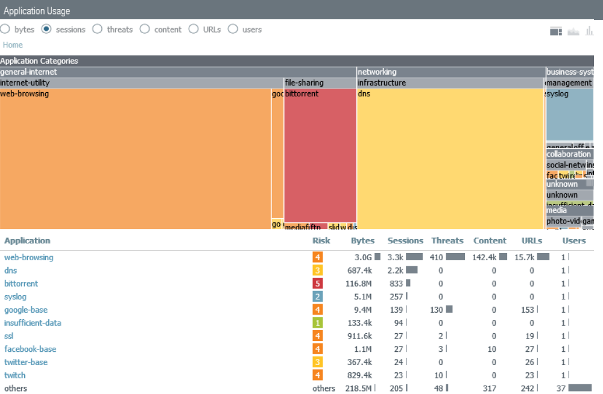

# gp-flux
Openconnect GlobalProtect client traffic generator

Example, client certificate/key in C:\docker\certificates
docker run -it --privileged --mount type=bind,source="C:\docker\certificates",target=/opt/gp-flux/certificates -e GP_USERNAME=CHANGE-ME -e GP_GATEWAY=CHANGE-ME -e GP_PASSWORD=CHANGE-ME anq12/gp-flux

Example, no client certificate
docker run -it --privileged -e GP_USERNAME=CHANGE-ME -e GP_GATEWAY=CHANGE-ME -e GP_PASSWORD=CHANGE-ME anq12/gp-flux

Notes / Requirements:
- Container is designed to connect directly to GP Gateway. GP Portal -> Gateway is only supported if they use the same FQDN.
- Only certificate-based 2FA is supported
- Multi-gateway selection is not supported

Default actions:
Bittorrent (transmission-daemon) - 100KB/s up/down limit - 200 max peers

Noisy.py HTTP/HTTPS - top 250 sites - no adult sites (as per PANW URL category)

nmap against GP-issued DNS servers

curl all PANDB category-example sites

wget Bacon Ipsum, syslog result to 8.8.8.8

wget FTP - 200KB/s limit

SMTP dummy files - swaks/smtpbucket

Examples:
Single instance using docker run

Multiple instances using docker-compose

ACC report by sessions, 1 hour runtime, decryption enabled
